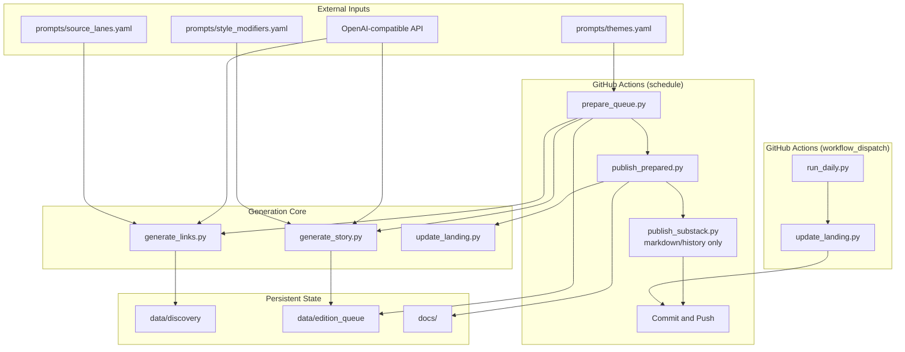
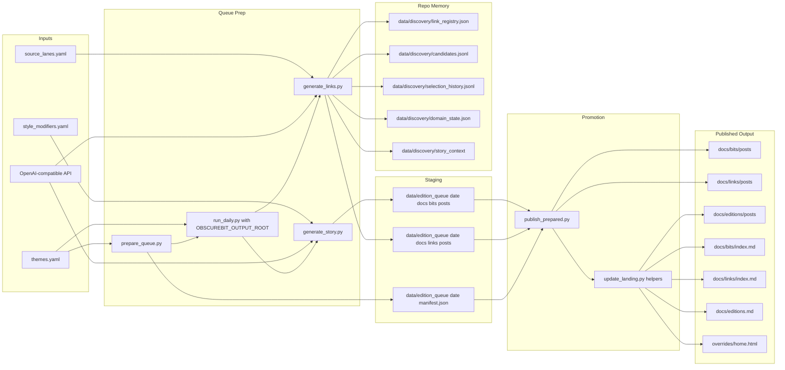
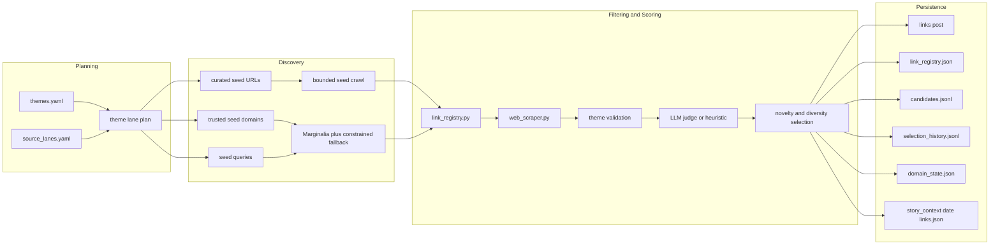
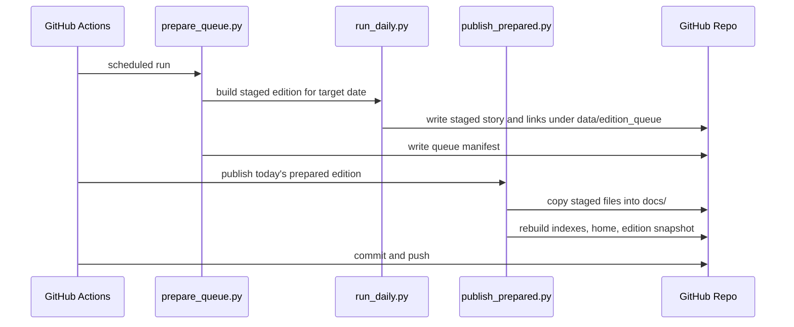
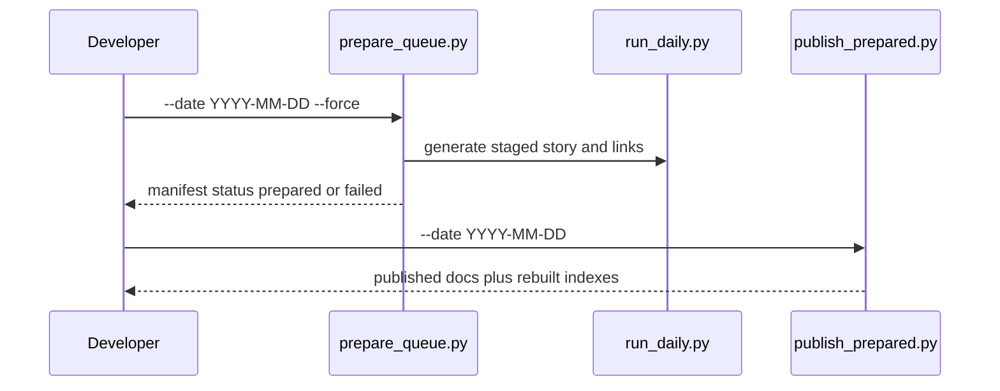

# Obscure Bit System Design

## Overview

Obscure Bit is a queue-first daily publishing system for stories, curated links, and edition pages.

- Scheduled GitHub Actions runs no longer publish directly from live generation.
- The scheduled path prepares staged content under `data/edition_queue/<date>/` first, then promotes that prepared edition into `docs/`.
- `scripts/run_daily.py` still exists as the single-date orchestrator, but it is now mainly the engine behind queue preparation and manual escape-hatch runs.
- Link discovery remains lane-first and repo-memory-backed.
- Story generation remains deterministic by date through the style-modifier system.
- `scripts/publish_substack.py` is still part of the repo, but CI only uses it to generate newsletter markdown/history unless explicitly run in draft/publish mode.

## Architecture



## Data Flow



## Queue-First Publish Model

The main reliability change is that daily publishing is no longer supposed to depend on live discovery succeeding in the same step that updates the public site.

### Scheduled Path

1. `scripts/prepare_queue.py` selects one or more target dates.
2. For each date it runs `scripts/run_daily.py` with `OBSCUREBIT_OUTPUT_ROOT` pointed at `data/edition_queue/<date>/`.
3. `run_daily.py` generates links first; if link generation fails, it can fall forward through multiple rotating themes for that date.
4. When links succeed, the same theme is reused for story generation so the edition stays internally consistent.
5. `scripts/publish_prepared.py` copies the staged story and links into `docs/`, rebuilds indexes and edition snapshot pages, and updates the queue manifest to `published`.

### Manual Escape Hatches

- `workflow_dispatch` still runs `run_daily.py` directly for one-off manual generation.
- Developers can still run `generate_story.py`, `generate_links.py`, or `update_landing.py` individually.
- Backfills should now prefer `prepare_queue.py --date ... --force` followed by `publish_prepared.py --date ...`.

## Story Generation and Style Modifiers

Story generation is driven by `scripts/generate_story.py`.

### Deterministic Daily Seed

- A seed is derived from `SHA-256(YYYY-MM-DD)` in `get_daily_seed()`.
- The same date always produces the same style modifier combination.
- That makes backfills reproducible as long as prompts and models are unchanged.

### Current Modifier Shape

The style system currently samples from 14 dimensions plus one banned-word set, not the older 9-dimension version.

| Dimension | Count |
|-----------|-------|
| `pov` | 10 |
| `tone` | 10 |
| `era` | 10 |
| `setting` | 12 |
| `structure` | 10 |
| `conflict` | 10 |
| `opening` | 10 |
| `genre` | 10 |
| `wildcard` | 10 |
| `protagonist` | 12 |
| `desire` | 10 |
| `anchor_object` | 12 |
| `social_pressure` | 10 |
| `ending_shape` | 10 |
| `banned_word_sets` | 8 |

That yields roughly `1.3824e15` possible combinations before model variation.

### What the Modifiers Affect

- Prompt voice and structure
- Character role and social pressure
- Desired outcome and ending shape
- One explicit `genre` label
- A banned-word set that discourages repetitive speculative vocabulary

### Genre Propagation

The chosen `genre` is written into story frontmatter by `generate_story.py`, then read by `update_landing.py` to decorate:

- the homepage feature card
- bits archive cards
- edition pages and edition archive cards

### Candidate Selection and Routing

`generate_story.py` also supports:

- `STORY_CANDIDATES` for multiple draft generation and selection
- `STORY_MODEL_ROUTING` and `prompts/story_model_routing.yaml` for brief-based writer-model routing
- `STORY_SELECTOR_MODEL` for an optional separate selector model

Queue prep intentionally overrides some of those defaults for speed and reliability:

- `STORY_CANDIDATES=1`
- `STORY_MODEL_ROUTING=0`
- `OPENAI_REQUEST_TIMEOUT=90`

## Link Generation Architecture

The link system remains lane-first and repo-memory-backed.



### Link-System Properties

- Discovery starts from curated seeds and trusted domains rather than broad search fanout.
- A persistent URL registry prevents re-publishing the same normalized URL.
- The discovery corpus stores candidates and domain freshness across days.
- `story_context/<date>-links.json` exports same-day motifs into story generation.
- Fallback thresholds exist, but only after stricter theme and quality filters run first.

## Action Flows

### 1. Scheduled Daily Run



### 2. Manual Backfill



### 3. Manual Direct Run

Use this when you explicitly want to bypass the queue:

```bash
uv run --python .venv/bin/python scripts/run_daily.py --date 2026-04-19
```

`run_daily.py` now has:

- idempotent skip behavior if story or links already exist
- bounded per-step timeouts
- multi-theme fallback for links when no explicit `--theme-json` is supplied

### 4. Substack Workflow

- CI runs `scripts/publish_substack.py` with no publish flags, which is used for newsletter markdown/history generation.
- Actual Substack draft/publish actions still require running `publish_substack.py --draft` or `--publish`.
- `scripts/substack_playwright.py` remains the helper for extracting cookies when API auth via browser session is needed.

## File Structure

```text
b1ts/
├── .github/workflows/
│   └── generate-content.yml
├── docs/
│   ├── bits/posts/
│   ├── links/posts/
│   ├── editions/posts/
│   ├── bits/index.md
│   ├── links/index.md
│   ├── editions.md
│   └── substack/
├── scripts/
│   ├── run_daily.py
│   ├── generate_story.py
│   ├── generate_links.py
│   ├── prepare_queue.py
│   ├── publish_prepared.py
│   ├── project_paths.py
│   ├── discovery_corpus.py
│   ├── link_registry.py
│   ├── backfill_registry.py
│   ├── update_landing.py
│   ├── publish_substack.py
│   └── substack_playwright.py
├── prompts/
│   ├── themes.yaml
│   ├── source_lanes.yaml
│   ├── style_modifiers.yaml
│   ├── story_model_routing.yaml
│   └── ...
├── data/
│   ├── discovery/
│   │   ├── link_registry.json
│   │   ├── candidates.jsonl
│   │   ├── selection_history.jsonl
│   │   ├── domain_state.json
│   │   └── story_context/
│   └── edition_queue/
│       └── YYYY-MM-DD/
│           ├── docs/bits/posts/
│           ├── docs/links/posts/
│           └── manifest.json
└── cache/
    └── web_content/
```

## Environment Variables

### Core Model Settings

```bash
OPENAI_API_KEY
OPENAI_API_BASE
OPENAI_MODEL
STORY_SELECTOR_MODEL
STORY_MODEL_ROUTING
STORY_CANDIDATES
OPENAI_REQUEST_TIMEOUT
OPENAI_MAX_RETRIES
```

### Orchestrator and Queue Controls

```bash
AUTO_THEME_ATTEMPTS
RUN_DAILY_LINK_TIMEOUT_SECONDS
RUN_DAILY_STORY_TIMEOUT_SECONDS
RUN_DAILY_LANDING_TIMEOUT_SECONDS
OBSCUREBIT_OUTPUT_ROOT
```

### Substack

Used only when running Substack draft/publish flows:

```bash
SUBSTACK_PUBLICATION_URL
SUBSTACK_EMAIL
SUBSTACK_PASSWORD
SUBSTACK_COOKIES
SUBSTACK_COOKIES_PATH
```

## Error Handling

### Queue Prep Failures

- `prepare_queue.py` records `failed` manifests when staging does not complete.
- The scheduled workflow currently marks queue prep `continue-on-error: true`, so a publish step can still run if today's prepared edition already exists.

### Direct Run Failures

- `run_daily.py` applies explicit timeouts to link, story, and landing steps.
- Link generation can retry across multiple rotating themes for the target date.
- Explicit `--theme-json` runs do not silently fall to another theme.

### Link Discovery Failures

- Curated seeds, trusted domains, and repo-backed discovery memory reduce dependence on live search luck.
- The registry and corpus are committed so selection state persists across runs.

### Substack Failures

- Cloudflare and auth issues still make true publish automation brittle.
- Markdown/history generation is safe in CI.
- Draft/publish actions should still be treated as operator-driven.

## Monitoring

- GitHub Actions run status
- Queue manifests under `data/edition_queue/<date>/manifest.json`
- Published docs pages and indexes
- Discovery corpus changes under `data/discovery/`
