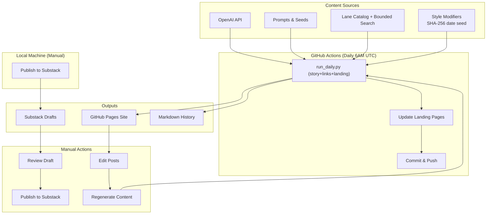
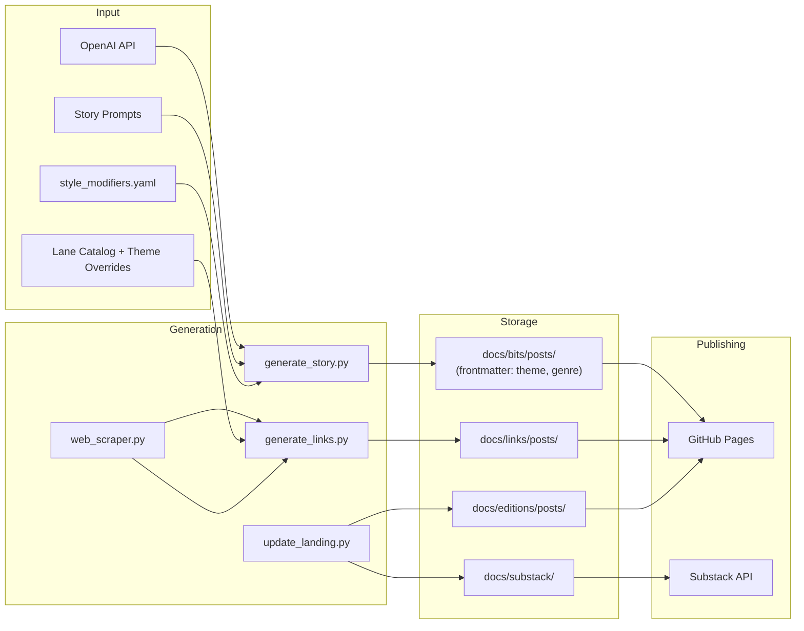
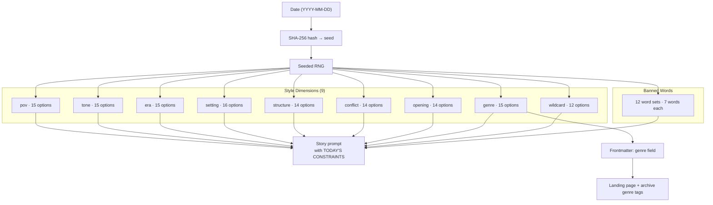
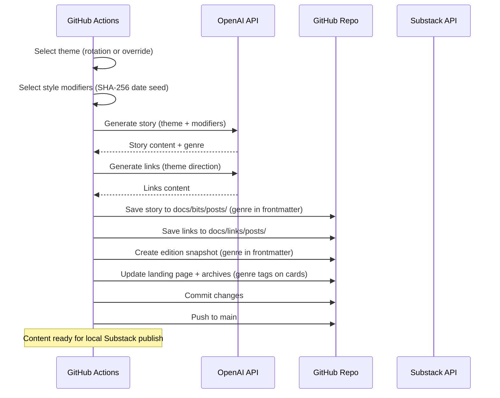
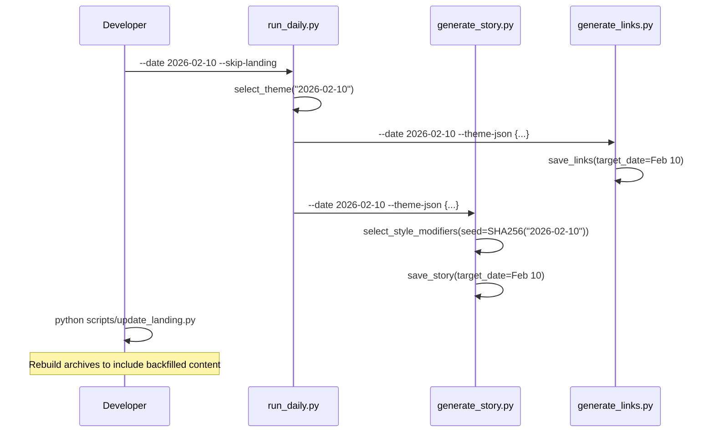
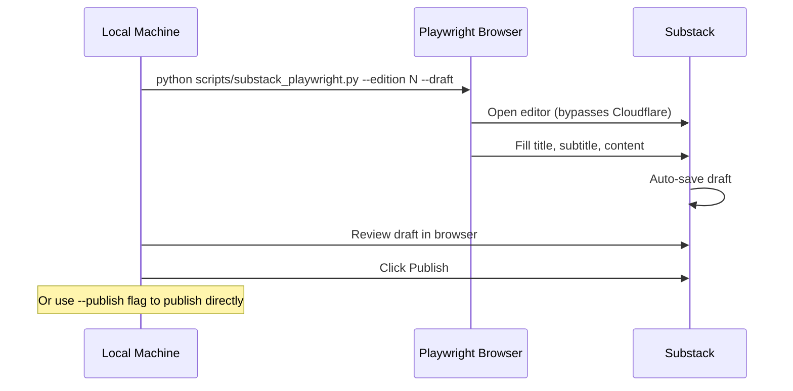
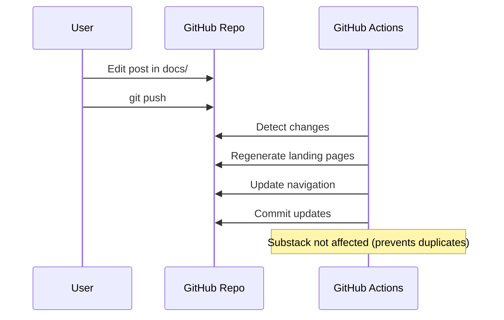
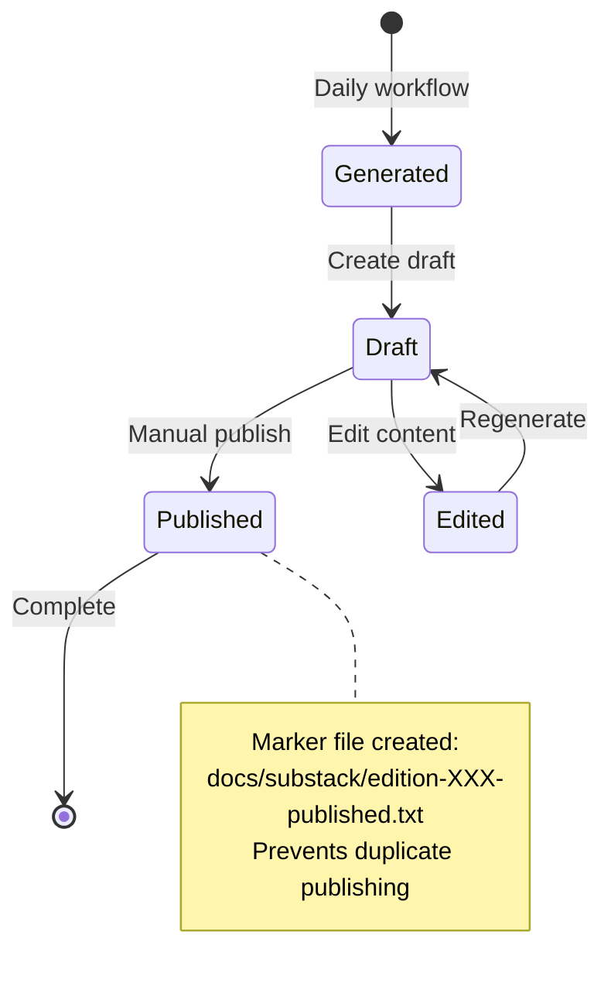

# Obscure Bit System Design

## Overview

Obscure Bit is an automated content generation system that creates and publishes daily stories, curated links, and newsletter editions. A single orchestrator (`run_daily.py`) synchronizes theme selection and triggers the story, link, and landing generators. The system runs on GitHub Actions for content generation and publishes to GitHub Pages. Substack publishing requires local execution due to Cloudflare restrictions.

## Architecture



## Data Flow



## Style Modifiers System

Each story is shaped by randomized constraints drawn from `prompts/style_modifiers.yaml`. This ensures variety even when themes repeat on their 18-day rotation.



### Properties
- **Deterministic**: Same date → same modifiers (reproducible backfills)
- **Combinatorial**: ~15^9 × 12 ≈ 460 billion unique combinations
- **Anti-repetition**: Banned word sets rotate to prevent stylistic staleness
- **Genre propagation**: Genre flows from modifier → frontmatter → HTML cards via `update_landing.py`

## Link Generation Architecture (v4 - Lane-First Discovery + Repo Memory)

The link generation system is now lane-first. It no longer depends on generic search-provider fanout as the primary discovery method. Instead it starts from curated source neighborhoods, expands them with a bounded crawl, optionally asks the LLM for a small number of better angles inside those neighborhoods, and then scores candidates against a repo-backed discovery corpus.

```mermaid
flowchart LR
    subgraph "Stage 1: Theme Planning"
        TP1[Load themes.yaml]
        TP2[Load source_lanes.yaml]
        TP3[Merge global lanes + theme overrides]
    end
    
    subgraph "Stage 2: Lane Discovery"
        D1[Curated seed URLs]
        D2[Trusted lane domains]
        D3[Lane query templates]
        D4[Bounded one-hop seed crawl]
        D5[Marginalia / limited DDG fallback]
    end
    
    subgraph "Stage 3: Repo Memory Filter"
        REG[link_registry.py]
        CORPUS[discovery_corpus.py]
        REG2[Reject previously-published URLs]
    end
    
    subgraph "Stage 4: Scraping"
        S1[Fetch Content]
        S2[Extract Concepts]
        S3[Score Obscurity]
    end
    
    subgraph "Stage 5: Theme Validation"
        V1[Focus-term match]
        V2[Theme drift rejection]
        V3[Theme-blocked domains]
        V4[LLM judge or fallback heuristic]
    end
    
    subgraph "Stage 6: Selection"
        SEL[Composite scoring]
        QG[Listicle / boilerplate / bad-page filter]
        DIV[Similarity and lane diversity]
        DOM[Domain and novelty balancing]
        OUT[Select best links]
    end
    
    TP1 --> TP2
    TP2 --> TP3
    TP3 --> D1
    TP3 --> D2
    TP3 --> D3
    D1 --> D4
    D2 --> D5
    D3 --> D5
    D4 --> REG
    D5 --> REG
    REG --> REG2
    CORPUS --> SEL
    REG2 --> S1
    S1 --> S2
    S2 --> S3
    S3 --> V1
    V1 --> V2
    V2 --> V3
    V3 --> V4
    V4 --> SEL
    SEL --> QG
    QG --> DIV
    DIV --> DOM
    DOM --> OUT
    OUT --> REG4[Persist registry + corpus + story context]
```



### Lane-First Discovery

The active link system is built around curated lanes defined in `prompts/source_lanes.yaml`.

Each lane represents a different kind of high-signal web neighborhood:
- `primary-doc`
- `enthusiast-research`
- `old-web`
- `museum-object`
- `local-history`
- `niche-institution`
- `indie-essay`

For each daily theme, the generator:

1. Loads theme-specific lane preferences, seeds, focus terms, drift terms, and blocked domains.
2. Starts from trusted seed URLs and seed domains instead of broad internet search.
3. Runs a bounded one-hop crawl on seed pages to surface adjacent artifact pages.
4. Executes only a small number of lane-shaped search queries, primarily through Marginalia and a tightly constrained DuckDuckGo fallback.
5. Uses the LLM only for limited query expansion inside the trusted lane architecture, not for open-ended URL hunting.

This keeps discovery in better neighborhoods and materially reduces forum junk, SEO sludge, and generic encyclopedia drift.

### URL Registry (Cross-Day Deduplication)

A persistent SHA-256 hash registry (`data/discovery/link_registry.json`) prevents the same URL from ever being published twice:

1. **Normalize** – lowercase domain, strip `www.`, remove tracking params (`utm_*`, `fbclid`, etc.), sort query params, strip trailing slashes
2. **Hash** – SHA-256 of the normalized URL → deterministic key
3. **Filter** – before scoring, every candidate URL is checked against the registry; known URLs are rejected
4. **Register** – after saving, all selected URLs are added to the registry with date, theme, title, and domain metadata
5. **Domain frequency** – the registry tracks per-domain counts across all days, enabling cross-run diversity caps

The registry and the broader discovery memory live under `data/discovery/`, which is intended to be committed so nightly runs do not start from zero.

### Discovery Corpus and Story Context

`scripts/discovery_corpus.py` persists more than a hard dedup list:

- `candidates.jsonl` stores compact scored candidate records
- `selection_history.jsonl` stores published-link history for novelty penalties
- `domain_state.json` tracks freshness and frequency by domain
- `story_context/<date>-links.json` exports same-day motifs and interesting bits into story generation

That repo-backed memory lets the selector penalize repetition and lets the story system borrow texture from the same day’s chosen links.

### Quality Gates

Multiple layers prevent low-quality content from reaching publication:

- **Global disallowed domains**: Wikipedia, Archive.org, GitHub, StackExchange, major social feeds, and other junk-heavy surfaces are filtered early.
- **Bad-page detection**: Homepages, category pages, product pages, forum/event pages, privacy/policy pages, and thin institutional pages are rejected.
- **Listicle filter**: Catches numbered titles, clickbait phrasing, guides, and game-tip style pages.
- **Theme focus terms**: Candidate relevance is anchored to theme-specific phrases from `source_lanes.yaml`, not just generic keyword overlap.
- **Theme drift rejection**: Per-theme drift terms and blocked domains can reject pages that are obscure but clearly off-brief.
- **Fallback scoring**: If LLM judging is unavailable, the system falls back to a deterministic heuristic that rewards lane quality, obscurity, focus hits, and interesting bits.

Downstream safeguards still allow fallback thresholds when the strict pass is too thin, but the intent is now “rescue real near-misses” rather than “accept anything remotely related.”

## Action Flows

### 1. Daily Content Generation (Automated)



### 1b. Backfill Generation (Manual)

All scripts accept `--date YYYY-MM-DD` to generate content for past dates. The date controls theme selection, style modifier seed, and output filenames.



### 2. Local Substack Publishing (Manual)

**Note:** Substack uses Cloudflare protection that blocks GitHub Actions datacenter IPs. Publishing must be done locally.



#### Local Setup
```bash
# One-time: install Playwright into the project venv and login
uv pip install --python .venv/bin/python playwright
uv run --python .venv/bin/python playwright install chromium
uv run --python .venv/bin/python scripts/substack_playwright.py --login

# Daily: Publish edition
uv run --python .venv/bin/python scripts/substack_playwright.py --edition 3 --draft
```

### 3. Content Update Flow



## File Structure

```
b1ts/
├── .github/workflows/
│   └── generate-content.yml    # Daily automation
├── docs/
│   ├── bits/posts/             # Daily stories
│   ├── links/posts/            # Daily links
│   ├── editions.md             # Edition archive
│   ├── substack/               # Newsletter drafts & history
│   │   ├── YYYY-MM-DD-edition-XXX.md
│   │   └── edition-XXX-published.txt
│   └── stylesheets/
├── scripts/
│   ├── run_daily.py            # Theme orchestrator (story + links + landing)
│   ├── generate_story.py       # AI story generation with same-day link context
│   ├── generate_links.py       # Lane-first link discovery + scoring
│   ├── discovery_corpus.py     # Repo-backed candidate memory and novelty-aware selection
│   ├── link_registry.py        # Persistent SHA-256 URL registry for cross-day dedup
│   ├── backfill_registry.py    # Seeds registry from existing posts
│   ├── web_scraper.py          # Content extraction & analysis
│   ├── update_landing.py       # Site updates (parses genre → HTML tags)
│   ├── publish_substack.py     # Substack API publishing
│   ├── substack_playwright.py  # Cookie extraction helper
│   └── test_web_access.py      # Web access diagnostics
├── prompts/
│   ├── story_system.md         # Story generation prompts
│   ├── links_system.md         # Link generation system prompt
│   ├── links_judge_system.md   # Structured hidden-gem scoring prompt
│   ├── source_lanes.yaml       # Curated lane catalog + theme overrides
│   ├── research_strategy_system.md  # Limited LLM query-expansion prompt
│   ├── themes.yaml             # Unified themes for stories + links
│   └── style_modifiers.yaml    # Randomized story constraint pools (9 dimensions)
├── data/discovery/
│   ├── link_registry.json      # Persistent URL hash registry (cross-day dedup)
│   ├── candidates.jsonl        # Repo-backed discovery corpus
│   ├── selection_history.jsonl # Published-link history for novelty penalties
│   ├── domain_state.json       # Per-domain freshness/frequency tracking
│   └── story_context/          # Same-day link motifs for story generation
└── cache/
    └── web_content/            # Ephemeral scraped content
```

## Environment Variables

### GitHub Secrets
```yaml
OPENAI_API_KEY:          # OpenAI-compatible API access
OPENAI_API_BASE:         # API endpoint (NVIDIA by default)
OPENAI_MODEL:            # Default model name
STORY_MODEL_ROUTING:     # Enable brief-based story model routing
STORY_CANDIDATES:        # Number of story drafts to generate before selection
STORY_SELECTOR_MODEL:    # Optional separate selector/editor model
# Note: Substack secrets removed - Cloudflare blocks CI
```

### Local Development
```bash
export OPENAI_API_KEY="..."
export OPENAI_API_BASE="https://integrate.api.nvidia.com/v1"
export OPENAI_MODEL="nvidia/llama-3.3-nemotron-super-49b-v1.5"
export STORY_MODEL_ROUTING="1"
export STORY_CANDIDATES="2"
export STORY_SELECTOR_MODEL="$OPENAI_MODEL"
export SUBSTACK_PUBLICATION_URL="https://obscurebit.substack.com"
export SUBSTACK_COOKIES_PATH="$HOME/.substack_cookies.json"
```

## Publishing States



## Error Handling

### OpenAI API Failures
- Retry mechanism with exponential backoff
- Link scoring falls back to deterministic heuristics if the judge call fails
- Story generation exits clearly if the OpenAI client itself is unavailable

### Link Discovery Failures
- Marginalia is the main external discovery fallback; DuckDuckGo is used sparingly
- Per-theme lane seeds and seed crawls still provide some discovery even if broader search is weak
- The repo-backed corpus and registry preserve prior discovery state across runs
- Theme-specific drift blocks prevent “obscure but wrong” pages from sneaking through just because the run is sparse

### Substack Failures
- Cloudflare blocks GitHub Actions IPs (use local publishing)
- Playwright browser automation bypasses Cloudflare locally
- Browser state saved in ~/.playwright_state.json
- Draft creation is non-destructive
- Duplicate prevention protects against retries

### GitHub Actions Failures
- Workflow continues on partial failures
- Content generation independent from publishing
- Manual recovery possible

## Scaling Considerations

### Content Volume
- Daily editions: ~365 posts/year
- Storage: Minimal (markdown files)
- API calls: ~4-6 per day (story generation, link research strategy, link scoring, link summaries)

### Performance
- Generation time: ~30 seconds
- Site rebuild: ~2 minutes
- Substack draft: ~10 seconds

### Cost Management
- OpenAI tokens: ~5K per day
- GitHub Actions: Free tier sufficient
- Substack: Free tier

## Future Enhancements

1. **Scheduled Publishing**: Auto-publish drafts at specific times
2. **Content Caching**: Reduce API calls for unchanged content
3. **Multi-platform**: Add Twitter, LinkedIn integration
4. **Analytics**: Track engagement and optimize content
5. **A/B Testing**: Test different content formats

## Security Considerations

- All secrets stored in GitHub Secrets
- No credentials in code
- Cookie-based auth for Substack
- Read-only file permissions for content

## Monitoring

- GitHub Actions dashboard for workflow status
- Draft review in Substack dashboard
- Site health via GitHub Pages status
- Error notifications via GitHub issues
- Mixpanel telemetry embedded in the site head records anonymous story/link views (autocapture + manual `Story Viewed` / `Links Viewed` events), giving real-time engagement while keeping everything anonymous by default.
